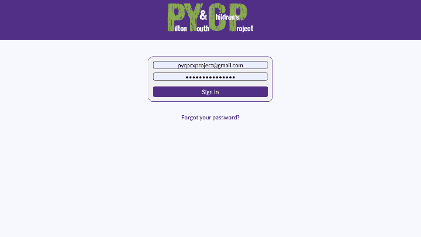

# Pilton Youth & Children's Project
> Refactor an administration app for the staff at Pilton Youth and Children's Project ( Source Code Under NDA )

## Table of Contents
* [My Role](#my-role)
* [Technologies Used](#technologies-used)
* [The Client](#the-client)
* [The Team](#the-team)
* [The Application](#the-application)
* [My Actions](#my-actions)
* [Lessons Learned](#Lessons-learned)
* [Screenshots](#screenshots)
* [Acknowledgements](#acknowledgements)
* [Contact](#contact)

## My Role
- Front End Developer ( React & CSS )
- Refactor and maintain an administration application for the staff at PYCP.

## Technologies Used
* [Javascript](https://www.javascript.com/)
* [React](https://reactjs.org/) - version 16.10.2
* [Firebase](https://firebase.google.com/) - version 7.16.0
* [React Router](https://reactrouter.com/web/guides/quick-start) - version 5.1.2

## The Client
- PYCP is a youth group who help and support children and young people in the local community. They rely on funding in order to provide them opportunities for new experiences and support to any difficulties so they can have the best chance of a successful future.

## The Team
- We inherited the project at the start of July 2020. Where we worked remotely due to Covid-19.
6 Software Developer Graduates, 3 working on the front end refactoring and maintaining, 3 on the back end refactoring the database from MongoDB to Firebase.

- Using Agile methodologies (specifically Scrum) one of the instructors acted as a product owner but we created the backlog ourselves and picked off user stories to plan each sprint. One of us acted as a Scrum master to manage the work we were doing. 

- At the end of each sprint we demoed working software. At the start of each morning we had a standup to discuss what we had been working on and what we were going to do that day.

- updating the status on tickets, code reviews along with Sprint planning, Sprint review and Sprint retrospective meetings. In a work environment, with real clients from community organisations. organisations

## The Application

## My Actions

## Lessons Learned

## Screenshots

## Acknowledgements
- [Pilton Youth & Children's Project](https://pycp.co.uk/).
- [Scottish Tech Army](https://www.scottishtecharmy.org/)

## Contact
- [drewpeattie@hotmail.com](mailto:drewpeattie@hotmail.com) - feel free to contact me!
