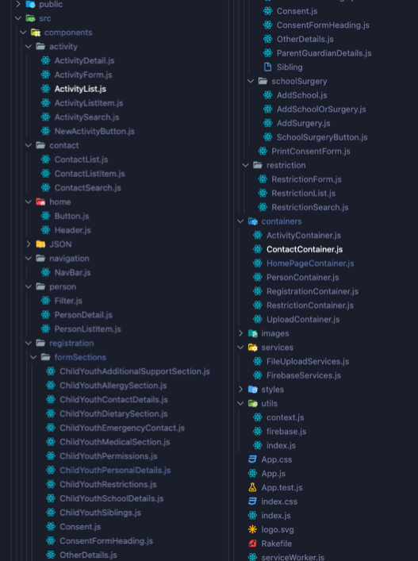
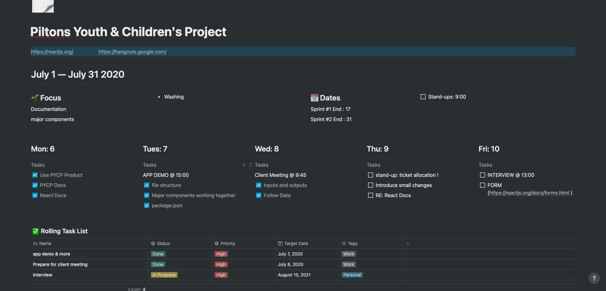

# Pilton Youth & Children's Project
> Refactor an administration app for the staff at Pilton Youth and Children's Project ( Source Code Under NDA )

## Table of Contents
* [My Role](#my-role)
* [Technologies Used](#technologies-used)
* [The Client](#the-client)
* [The Team](#the-team)
* [The Application](#the-application)
* [Screenshots](#screenshots)
* [My Actions](#my-actions) 
* [Acknowledgements](#acknowledgements)
* [Contact](#contact)

## My Role
- Front End Developer ( React & CSS )
- Refactor and maintain an administration application for the staff at PYCP.

## Technologies Used
* [Javascript](https://www.javascript.com/)
* [React](https://reactjs.org/) - version 16.10.2
* [Firebase](https://firebase.google.com/) - version 7.16.0
* [React Router](https://reactrouter.com/web/guides/quick-start) - version 5.1.2

## The Client
- PYCP is a youth group who help and support children and young people in the local community. They rely on funding in order to provide them opportunities for new experiences and support to any difficulties so they can have the best chance of a successful future.

## The Team
- We inherited the project at the start of July 2020. Where we worked remotely due to Covid-19.
6 Software Developer Graduates, 3 working on the front end refactoring and maintaining, 3 on the back end refactoring the database from MongoDB to Firebase.

- Using Agile methodologies (specifically Scrum) one of the instructors acted as a product owner but we created the backlog ourselves and picked off user stories to plan each sprint. One of us acted as a Scrum master to manage the work we were doing. 

- At the end of each sprint we demoed working software. At the start of each morning we had a standup to discuss what we had been working on and what we were going to do that day.

- updating the status on tickets, code reviews along with Sprint planning, Sprint review and Sprint retrospective meetings. In a work environment, with real clients from community organisations. organisations

## The Application
-The projected was created by a cohort of software developer graduates back in 2019. Since then the project has been worked on by numerous developers.

-The cohort we inherited from had been working on the project for 4 months. They had a good relationship with the client where they identified key problems with the project and created wireframes gaining feedback from the client. 
They put together an extensive documentation and brief using Google Drive shared online that made coming into this project easier.

-Core functionality:
* A landing page with navigation to all sections of the app.
* A consent form filled in by the admin staff or can be printed off and filled in that the staff can copy over into the app.
* Activities and clubs are created allocated individuals or groups of individuals.
* Generating specific reports on search options ie.. allergies, age & medical conditions
* Attendance register for activities
* Contact number page

## Screenshots

## My Actions
- The code base was very large unlike anything I had worked on before, Thankfully I was able to get a verbal overview of the system, I took notes and had questions ready beforehand. 

- I spent a day using the product as if I was a user to get a better feel of what it does while looking over the documentation, file structure and checking 3rd party libraries the app was using.

- Some of the things I learnt while working on the code base learn how the major parts ( components ) work together, state, props, JSX, Styling ( in React ), Conditional Rendering, Lists & Keys and Forms

## Acknowledgements
- [Pilton Youth & Children's Project](https://pycp.co.uk/).
- [Scottish Tech Army](https://www.scottishtecharmy.org/)

## Contact
- [drewpeattie@hotmail.com](mailto:drewpeattie@hotmail.com) - feel free to contact me!
